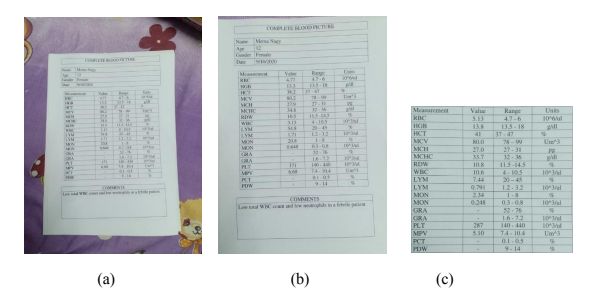

# Medical-Report-Analyzer

## Introduction

As the population of the world increases and humanity's main perspective has become better health, no of medical reports issued every day is growing at an enormous rate.
Keeping tracking all that data in paper form would be an impossible task for any laboratory, doctor, or even patient. So, the simple solution was to try harnessing the technology surrounding us and digitize those records, allowing retrieving and updating them anytime anywhere. Hence come our mobile application and website to allow the user to choose the platform of work he/she is suitable with.

So our App/Website tries to apply the new AI developed techniques in improving the healthcare system, provide the help that the patient needs in reading the test analysis and understanding the diagnosis of the condition, and save him lots of time and money and any data loss.

## Our Process

### StartThe App

First of all, The user need to fire up the application and sign up/in his personal data as a patient or doctor to have his own profile and hence the features he would need.

### Scan your reports

As a patient, To scan The reports, all you have to do is to access the camera option in the app or to upload it if it's already on the device.

Once it's done, our OCR and Regex algorithms will handle the data and digitalize it for you.

### Image Processing

Basically our algorithms detect the outlines of the report and try to crop it out of the whole captured picture, Then it focuses on the patient personal data and tables in the report, After that we extract the columns and rows and store them in a digital form to be later displayed.

We also put in the option for the user to fill out a table manually by himself

### Result table & Analysis

### Data Storage

After the user, checks out the validaty of the data either put by him or extracted by our app, the table is stored by our server in the data base after a table is built there, to allow the user its retrieval later on.

### Export Results

Finally, we allow the user to share the result with any doctor's profile he feel comfortable with, where the doctor will examine the report sent to him, give his medical opinion on it and notify the patient.

Also, we add medical context for every row in any medical report to explain to the patient if he has something severe or not and how to address any problem he would have.

## Future Work

Innovation is a non-stopping process, and for it to progress, you'll always have to come up with new ideas and better features. and that is what we seek for our project. We faced many problems during our journey, and our goal is to overcome each one of them soon.
Working our way to collect enough reports' templates so we can dispose of the standard form we are using giving more luxury for our users.

**For more Info check our Report.pdf or [watch Our Video](https://drive.google.com/file/d/1d4gJmIma0M3Om9zCbnpYNkvTnQt4l6ip/view?usp=sharing)**
